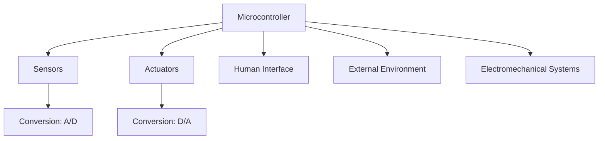

### Nature of System Functions

Embedded systems are designed to perform specific tasks, and their functions can be categorized as follows:

- **Control Laws**: These are algorithms that control the system's behavior. For example, in a temperature control system, the control law determines when to turn the heater on or off based on the current temperature.
- **Sequencing Logic**: This involves the order in which tasks are performed. It is task-specific and not general-purpose. For instance, in a washing machine, the sequencing logic determines the order of washing, rinsing, and spinning.
- **Signal Processing**: This is necessary for interfacing with external devices. It involves processing signals from sensors or to actuators. For example, in a sound system, signal processing is used to amplify or filter audio signals.
- **Application Specific Interfacing**: The type of sensors and actuators used depends on the application. For example, a robotic arm might use position sensors and servo motors.
- **Fault Response**: This involves the system's ability to degrade gracefully in the event of a failure. For example, if a sensor fails, the system might switch to a backup sensor or enter a safe mode.

---

## Architecture

The architecture of an embedded system is the blueprint that defines its structure and behavior. It typically includes the following components:

- **Microcontroller**: The central processing unit (CPU) that executes the system's software.
- **Sensors**: Devices that gather data from the environment. Examples include temperature sensors, pressure sensors, and motion detectors.
- **Actuators**: Devices that perform actions based on the system's output. Examples include motors, relays, and solenoids.
- **Conversion**: Analog-to-digital (A/D) and digital-to-analog (D/A) converters are used to interface between the digital microcontroller and the analog sensors/actuators.
- **Human Interface**: Diagnostic and auxiliary tools that allow humans to interact with the system. Examples include displays, keypads, and diagnostic software.
- **External Environment**: The system interacts with the external environment through sensors and actuators.
- **Electromechanical Systems**: These include power supplies, cooling systems, backup systems, and safety mechanisms.

### Block Diagram of Embedded System Architecture



---

## Implementing Embedded Systems

### Hardware
- **Processing Element**: The core computational unit, such as a CPU, DSP (Digital Signal Processor), or FPGA (Field-Programmable Gate Array).
- **Peripherals**: Additional hardware components that support the processing element, such as timers, communication interfaces (UART, SPI, I2C), and memory controllers.
- **Input & Output Devices**: Sensors (input) and actuators (output) that interact with the environment.

### Software
- **Interfacing Sensors & Actuators**: Protocols for communication between the microcontroller and sensors/actuators. Examples include I2C, SPI, and PWM (Pulse Width Modulation).
- **Partitioning**: Dividing tasks between hardware and software. For example, signal processing might be done in hardware for speed, while control logic is implemented in software.
- **Memory**: Storage for data and instructions. This includes RAM (Random Access Memory) for temporary data and ROM (Read-Only Memory) for firmware.
- **System Software**: This includes compilers, operating systems (OS), real-time schedulers, cross-compilers, emulators, and simulators.
- **Application Software**: Different applications that run on the same OS. For example, a smart thermostat might have separate applications for temperature control and user interface.

---

## Hardware Evolution

Embedded systems have evolved significantly over the years, driven by advancements in hardware technology:

- **Systems-on-Chip (SoC)**: These integrate multiple processor cores (e.g., ARM, DSP) and peripherals onto a single chip. SoCs are widely used in smartphones, IoT devices, and automotive systems.
- **Application Specific Processors**: Custom processors designed for specific tasks, such as image processing or cryptography.
- **General Purpose Microprocessors & Microcontrollers**: Versatile processors that can be used in a wide range of applications. Examples include the Intel x86 family and the ARM Cortex-M series.
- **Faster Clock Rates**: Increased processing speed allows for more complex computations and faster response times.
- **Higher Degree of Integration**: More components are integrated into a single chip, reducing the size and cost of embedded systems.

---

## Software

Embedded software must meet several key requirements:

- **Logical and Temporal Correctness**: The software must produce the correct output at the right time. This is especially important in real-time systems where missing a deadline can have serious consequences.
- **Physical Concurrency**: Embedded systems often need to handle multiple tasks simultaneously. For example, a robot might need to process sensor data while controlling its motors.
- **Reactive Systems**: These systems respond to external events in real-time. For example, an anti-lock braking system (ABS) must react immediately to changes in wheel speed.
- **Reliability and Fault-Tolerance**: Embedded systems must be reliable and able to tolerate faults. This is critical in safety-critical systems like medical devices and automotive systems.
- **Application Specific**: Embedded software is typically designed for a single purpose, such as controlling a microwave oven or managing a smart home system.

---

## Multi-Tasking and Concurrency

Embedded systems often need to handle multiple tasks simultaneously. Multi-tasking involves switching between different tasks, while concurrency gives the appearance of simultaneous execution.

### Example: Concurrency in Temperature Controller

```c
/* Monitor Temperature */
do forever {
    measure temp;
    if (temp < setting)
        start furnace;
    else if (temp > setting + delta)
        stop furnace;
}

/* Monitor Time of Day */
do forever {
    measure time;
    if (6:00am)
        setting = 72°F;
    else if (11:00pm)
        setting = 60°F;
}

/* Monitor Keypad */
do forever {
    check keypad;
    if (raise temp)
        setting++;
    else if (lower temp)
        setting--;
}
```

In this example, the temperature controller must monitor the temperature, time of day, and keypad inputs concurrently. Each task runs in a loop, and the system switches between tasks to give the appearance of simultaneous execution.

---

## Challenges in Embedded System Design

Designing embedded systems presents several challenges:

- **Hardware Requirements**: Determining the necessary hardware, such as the CPU word size and memory size, is critical. For example, a 32-bit CPU might be required for complex computations, while a smaller memory might suffice for simple tasks.
- **Meeting Deadlines**: Real-time systems must meet strict deadlines. This can be achieved through faster hardware or more efficient software. However, even clever software may not meet deadlines if the hardware is too slow.
- **Power Consumption**: Minimizing power consumption is crucial, especially in battery-powered devices. Techniques include turning off unnecessary logic and reducing memory accesses.

---

## Embedded System Design Goals

The design of an embedded system is guided by several goals:

- **Performance**: The system must meet its performance requirements, such as overall speed and deadlines.
- **Functionality and User Interface**: The system must perform its intended functions and provide a user-friendly interface.
- **Manufacturing Cost**: The cost of manufacturing the system must be kept low to ensure affordability.
- **Power Consumption**: The system must minimize power consumption, especially in portable devices.
- **Other Requirements**: Additional requirements, such as physical size and weight, must also be considered.

---

## Functional vs. Non-Functional Requirements

- **Functional Requirements**: These define what the system should do. For example, a temperature control system must maintain the temperature within a specified range.
- **Non-Functional Requirements**: These define how the system should perform its functions. Examples include the time required to compute the output, size, weight, and power consumption.

---

## Design & Development Process

The design and development of an embedded system typically follows these steps:

1. **Requirements**: Define what the system needs to do.
2. **Specification**: Create a detailed description of the system's behavior.
3. **Architecture**: Design the high-level structure of the system.
4. **Component Design**: Design the individual components of the system.
5. **System Integration**: Combine the components into a complete system.

---

## Example: Quadcopter Design Process

### Controlling the Vehicle
- **Actuators**: The four rotors produce downward thrust. By balancing the thrust from the four rotors, the quadcopter can take off, land, turn, and even flip in the air.
- **Control Algorithms**: Sophisticated algorithms are required to determine the thrust to apply to each rotor.

### Weight Considerations
- **Energy Storage**: The heavier the quadcopter, the more energy it needs to carry, which increases its weight further.
- **Safety**: The rotors become dangerous to humans as the vehicle's weight increases. Even with a light vehicle, safety is a major concern, and the system must be designed with fault handling.

### Autonomous Operation
- **Localization**: The quadcopter must keep track of its position.
- **Obstacle Sensing**: It must sense and avoid obstacles.
- **Health Monitoring**: The system must continuously monitor its own health to detect and react to malfunctions.

---

## Top-Down vs. Bottom-Up Design

- **Top-Down Design**: Start with the most abstract description and work towards detailed implementation.
- **Bottom-Up Design**: Start with small components and build up to the complete system.
- **Real Design**: Uses both techniques iteratively.

---

## Modeling, Design, and Analysis

- **Modeling**: Imitating the system to understand its properties.
- **Design**: Creating structured artifacts that specify how the system works.
- **Analysis**: Dissecting the system to understand why it works (or fails).

---

## Stepwise Refinement

- **Analyze**: Determine characteristics of the current design.
- **Refine**: Add detail to the design at each level of abstraction.

---

## Continuous-Time Systems

A continuous-time system operates on continuous-time signals, modeled as:

```
S
|
parameters: y
|
p, q
```

Where:
- Input signal \( x \) and output signal \( y \) are functions of time.
- Domain: Time (ℝ or ℝ⁺).
- Codomain: Signal value at a particular time.

---

## Controller and Helicopter Example

A feedback control system stabilizes a helicopter model. The input \( \psi \) specifies the desired angular velocity, and the error signal \( e \) represents the difference between actual and desired velocity.

---

## Discrete Systems

A discrete system, such as a parking garage counter, tracks the number of cars using inputs (arrival, departure) and outputs (count).

---

## Finite State Machine for Garage Counter

A Finite State Machine (FSM) models the garage counter with states representing the number of cars and transitions based on arrivals and departures.

---

## Extended State Machine

An extended state machine includes variables (e.g., count) and conditions (e.g., up/down) to model more complex systems.

---

## AC Controller Example

An AC controller uses temperature inputs to turn heating on or off based on predefined thresholds.

---

## Traffic Light Controller Example

An extended state machine models a traffic light controller that reacts to pedestrian inputs and tracks time.

![[Pasted image 20250222023204.png]]

---

## Hybrid Systems

Hybrid systems combine continuous-time and discrete-time components, often used in complex control systems.

---

## Example of Path Tracking AGV

An Automated Guided Vehicle (AGV) follows a curved track, with deviations tracked using global coordinates.

---

## Cascade Combination of Actors

Actors can be combined in a cascade, where the output of one actor feeds into the input of another.

---

## Interconnection of Actors/Concurrency

Actors can be interconnected with feedback, modeled as a single composite actor.

---

## Feedback Model

A feedback model uses inputs and outputs to create a loop, where the output influences the input.

---

## Synchronous Data Flow Model

A synchronous data flow model processes data in a synchronized manner, with fixed rates of data production and consumption.

---

## Structured Data Flow for Conditional Firing

Conditional firing allows actors to execute based on specific conditions, enabling more complex control flows.

---

## Guide to Designing Embedded Systems

### Step-by-Step Guide to Answering Design Questions

1. **Understand the Problem**: Clearly define the system's requirements and constraints.
2. **Identify Functional and Non-Functional Requirements**: Determine what the system needs to do and any additional constraints (e.g., power, size).
3. **Choose the Right Hardware**: Select appropriate processing elements, sensors, and actuators based on the system's needs.
4. **Design the Software Architecture**: Partition tasks between hardware and software, and choose appropriate interfacing protocols.
5. **Model the System**: Create models to simulate the system's behavior and identify potential issues.
6. **Implement and Test**: Build the system and test it against the requirements.
7. **Iterate and Refine**: Use feedback from testing to refine the design.

### Example: Designing an Engine Throttle System

1. **Requirements**: The system must control the engine's throttle based on driver input and engine conditions.
2. **Hardware**: Choose a microcontroller, sensors (e.g., throttle position, engine speed), and actuators (e.g., throttle valve).
3. **Software**: Develop control algorithms to adjust the throttle based on sensor inputs.
4. **Testing**: Simulate various driving conditions to ensure the system responds correctly.
5. **Refinement**: Adjust the control algorithms based on test results to improve performance and reliability.